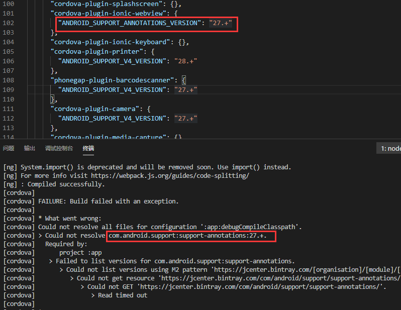

# Android编译问题汇总

## 一、Android问题：
### 1. ANDROID SDK未安装支持的版本

如上提示表示未安装android27版本的SDK支持，在SDK中安装后即可

## 二、Cordova问题：
### 1. CORDOVA-RES INSTALL 不能
运行下面命令，安装cordova-res的支持，会一直卡在下载sharp-libvips这里
```shell
npm i -g cordova-res
> ...
info sharp Downloading https://github.com/lovell/sharp-libvips/releases/download/v8.9.1/libvips-8.9.1-win32-x64.tar.gz
```

解决方式是：
```shell
npm i -g cordova-res --unsafe-perm
```
[参考到stackoverflow的回答](https://stackoverflow.com/questions/58539787/cordova-res-not-installing-in-ionic-cordova)